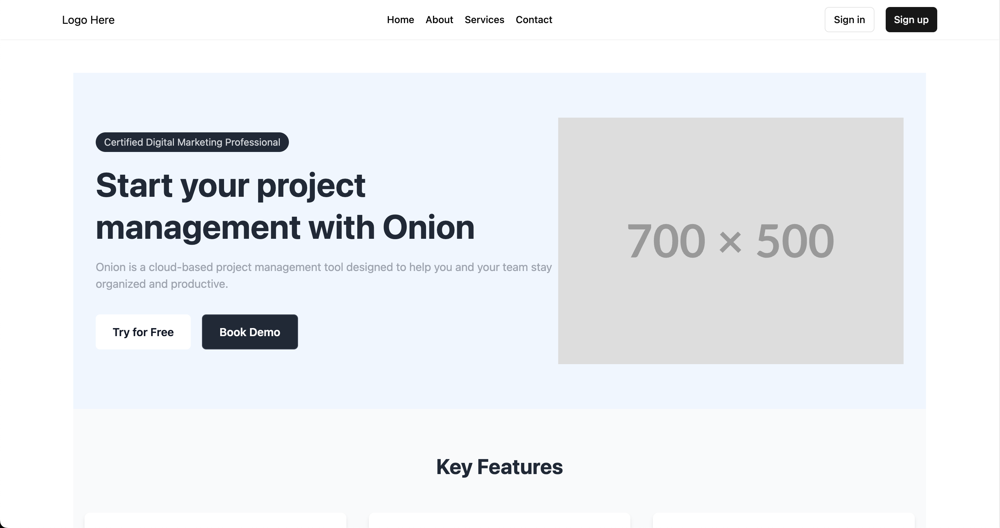

# React Express Neon Starter

This project is a starter kit built with React, TypeScript and Redux Toolkit. It includes a backend built with Express, Prisma, and NeonDB.

## Technologies Used

### Frontend
- React 18
- TypeScript
- Redux Toolkit
- React Router
- React Query
- Tailwind CSS
- Shadcn UI
- Axios
- Zod

### Backend
- Express
- Prisma
- PostgreSQL (via Neon)
- Passport JWT
- bcrypt

## Preview



## Prerequisites

Before you begin, ensure you have the following installed:

- Node.js (v14 or later)
- npm (v6 or later)

## Getting Started

1. Clone the repository:

   ```
   git clone git@github.com:jolouie7/react-express-neon-starter.git
   ```

2. Install dependencies for both frontend and backend:

   ```
   cd react-express-neon-starter
   cd frontend && npm install
   cd backend && npm install
   ```

3. Set up environment variables:
   - In the `backend` directory, create a `.env` file and add your database URL and JWT secret:
     ```
     PORT="your_port"
     DATABASE_URL="your_postgresql_or_neon_database_url"
     JWT_SECRET="your_jwt_secret"
     ```

4. Run database migrations:
   ```
   cd backend
   npx prisma migrate dev
   ```

5. Start the development servers:

   For the backend:
   ```
   cd backend
   npm run dev
   ```

   For the frontend:
   ```
   cd frontend
   npm run dev
   ```

   The frontend will be available at `http://localhost:5173`, and the backend will run on `http://localhost:8080` by default.

## Features

- User authentication (sign up, sign in, sign out)
- Protected routes
- Responsive design with mobile navigation
- Error handling and form validation
- State management with Redux Toolkit
- API integration with React Query

## Project Structure

- `frontend/`: Contains the React application
  - `src/`: Source files for the frontend
    - `components/`: React components
    - `features/`: Redux slices and related logic
    - `hooks/`: Custom React hooks
- `backend/`: Contains the Express server
  - `routes/`: API route definitions
  - `middleware/`: Custom middleware functions
  - `config/`: Configuration files (e.g., Passport setup)
  - `prisma/`: Prisma schema and migrations

## Future Features
- [ ] Oauth sign in
- [ ] Testing
- [ ] Improved navbar

## Contributing

Contributions are welcome! Please feel free to submit a Pull Request.

## License

This project is open source and available under the [MIT License](LICENSE).
